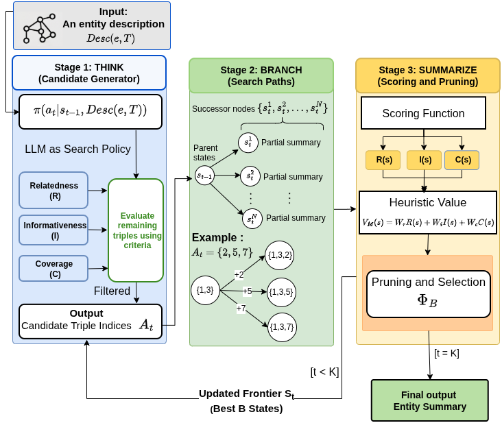

# ToT4ES: Tree of Thought for Entity Summarization (Think, Branch, Summarize)

This repository contains the implementation of ToT4ES, a research paper that submitted to EKAW 2026 conference (Research track). ToT4ES is an unsupervised method of extractive entity summarization relies on LLMs through Tree of Tought strategy that decomposes into three complementary semantic objectives: relatedness, informativeness, and coverage, to select entity summaries.

<p align="center">

</p>

## ⚙️ Installation
To run the ToT4ES framework, you need to install the following packages:

```bash
python 3.10+
torch
```

1. Create and activate a Conda environment:
```bash
conda create --name tot4es-env python=3.10
conda activate tot4es-env
```
2. Download the project
```bash
git clone https://github.com/dice-group/ToT4ES.git

# Navigate to ToT4ES directory
cd ToT4ES
```

2. Install required packages:
```bash
pip install torch
pip install -r requirements.txt
```

> ⚠️ **Important Note:** Ensure that all dependencies are correctly installed.

## 🚀 Quickstart
A minimal quickstart to run a small demo using the repository's test script.

1. Create and activate a virtual environment (venv):

```bash
python3 -m venv .venv
source .venv/bin/activate
```

2. Install dependencies:

```bash
pip install --upgrade pip
pip install -r requirements.txt
```

3. (Optional) If you plan to use Hugging Face models that require authentication, login:

```bash
huggingface-cli login
```

## ▶ Running ToT4ES

Follow these steps to run the baseline ToT4ES pipeline 
- Run a single-entity example (quick test):

```bash
python3 scripts/tot_entity_summarizer_task_decomposed.py \
	--nt datasets/ESBM_benchmark_v1.2/dbpedia_data/1/1_desc.nt \
	--dataset dbpedia \
	--max-summary-len 5
```

- Run the full baseline processing (iterates over dataset entities):

```bash
cd scripts
bash run_tot4es.sh
```

Usage (script options):

- Short options (POSIX):
	- `-d DIR` dataset root directory (overrides default `ROOT`)
	- `-o DIR` output directory
	- `-l DIR` logs directory
	- `-n NAME` dataset name (dbpedia, faces, lmdb, ...)
	- `-k INT` max summary length (top-k triples)
	- `-m ID` model id (HuggingFace model identifier)
	- `-t FLOAT` thought temperature
	- `-e FLOAT` eval temperature
	- `-g INT` GPU device index (also supported as `--gpu`)
	- `-L INT` limit entities (for quick tests)

- Long option:
	- `--gpu` accepts `--gpu=IDX` or `--gpu IDX` (sets GPU device index)

Examples:

Run with custom dataset path, output, and use GPU 0:

```bash
bash run_tot4es.sh -d ../datasets/ESBM_benchmark_v1.2/dbpedia_data -o ../outputs/myrun -l ../logs/myrun -g 0
```

Run with a smaller summary length and override the model (example uses the Qwen3 default):

```bash
bash run_tot4es.sh -k 5 -m "Qwen/Qwen3-coder-30B-A3B-Instruct" --gpu=0
```

Quick test limited to 5 entities:

```bash
LIMIT_ENTITIES=5 bash run_tot4es.sh
```

Notes:

- Do not set ablation environment variables (e.g. `USE_RANDOM_CANDIDATES`) if you want the baseline run.
- The script passes `--thought-temperature` and `--eval-temperature` to the Python runner; adjust these with `-t` and `-e` as needed.
- Default outputs are written to `outputs/results_1` and logs to `logs/experiment_1` unless overridden.
 - Default LLM model: `Qwen/Qwen3-coder-30B-A3B-Instruct` (can be changed with `-m`)

## **Results**

Table 2 — Highest F-measure (higher is better) comparing ToT4ES against baselines on three dataset benchmarks (DBpedia, LinkedMDB, FACES). Values are F-measure for K=5 and K=10 (top-K triples).

| Model / Dataset | DBpedia K=5 | DBpedia K=10 | LinkedMDB K=5 | LinkedMDB K=10 | FACES K=5 | FACES K=10 |
|---|---:|---:|---:|---:|---:|---:|
| RELIN | 0.265 | 0.495 | 0.285 | 0.345 | 0.114 | 0.254 |
| MPSUM | 0.306 | 0.504 | 0.265 | 0.424 | 0.152 | 0.286 |
| BAPREC | 0.321 | 0.459 | 0.335 | 0.307 | 0.131 | 0.258 |
| KAFCA | 0.316 | 0.512 | 0.227 | 0.399 | 0.122 | 0.298 |
| IRES | 0.325 | 0.540 | 0.350 | 0.445 | 0.128 | 0.265 |
| Zero-shot LLM | 0.220 | 0.391 | 0.018 | 0.004 | 0.142 | 0.163 |
| Chain of Thought LLM | 0.291 | 0.459 | 0.250 | 0.380 | 0.165 | 0.296 |
| **TOT4ES (our)** | **0.359** | **0.548** | **0.421** | **0.478** | **0.212** | **0.329** |


